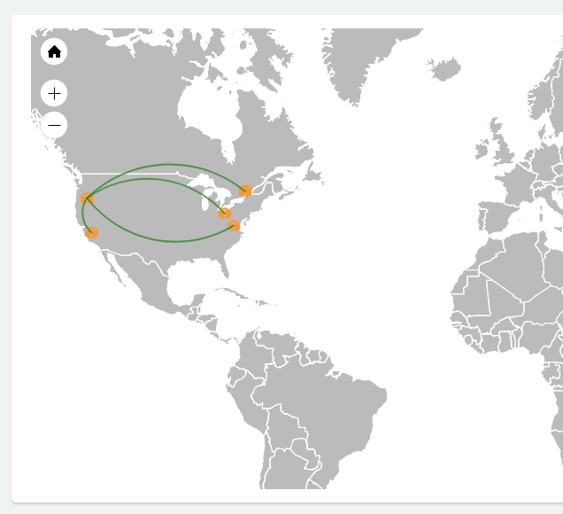

Overview
--------
A shared demo environment is available at https://demo.aviatrixtest.com.  This environment is not reset and is always on and available.

Separate from that demo environment is a new environment that can be utilized for product demos showcasing networking as code using Terraform configurations.

This demo environment is not shared and is only available as needed.  And, is automatically destroyed after each use.  It is intended to be set up prior to a demo using a setup script and will be available for a limited time after that initial creation.

Each demo environment is specific to an individual (or individuals) and consists of 2 parts:

1. A small instance to control the demo (build, modify, teardown, etc.).  This instance is always on and can be reached via SSH.  Each person who would like to demo Aviatrix will have their own control instance.

2. The demo components (controller, gateways).  



The remainder of this document assumes you have a demo environment.

Demo Environment Lifecycle
--------------------------
- Demo is built
  - This is a manual step that takes approximately 45 minutes to complete.
  - You will receive an email from `Aviatrix Demo` once complete

- Demo is available for 8 hours
  - The 8 hours starts once the demo is built successfully

- Demo is automatically destroyed
  - You will receive an email from `Aviatrix Demo` once complete

Prepare a new demo
------------------
To build your demo:
1. [SSH to your control instance](docs/SSH.md)
2. Execute the `aviatrix-demo` command with `build` flag.  This will begin the process of building your demo.  Leave this window open while it executes.  This step will take approximately 45 minutes.
3. When the `build` command is complete, login to your controller at:
   https://controller.&lt;your username here&gt;.aviatrix.live

   username: *admin*
   password: *P@ssw0rd!*


Demonstrate adding a new gateway and tunnels (live)
---------------------------------------------------
1. [SSH to your control instance](docs/SSH.md)
2. Execute the `aviatrix-demo` command with `add-request` flag.  This will create one new VPC with an Aviatrix Gateway and tunnel to the transit gateway.
3. Let this run.  This takes approximately 5 minutes to complete.

Optionally, if you prefer to run the terraform command manually, you can do these steps instead:
1. [SSH to your control instance](docs/SSH.md)
2. Execute the `aviatrix-demo` command with `add-request-manul` flag.  This will display the commands to run.  You can then copy and paste the commands and run them.  Or, copy and paste these commands:

```
cd ~/aviatrix-demo/steps/step-6-engineering
terraform apply -auto-approve -parallelism=1 -var-file=../../shared/aviatrix-admin-password.tfvars
```

Cleanup the new gateway and tunnels added in previous step
----------------------------------------------------------
1. [SSH to your control instance](docs/SSH.md)
2. Execute the `aviatrix-demo` command with `destroy-request` flag.  This will destroy just the new VPC, gateway, and tunnel added.
3. Let this run.  This takes approximately 5 minutes to complete.

