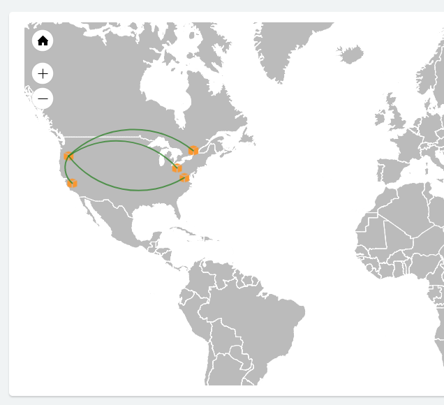

# Overview
This repository contains terraform configurations and related files to set up and tear down an Aviatrix demo environment.

# The Demo
This demo contains a base/initial configuration as well as an extended configuration. 

## Initial Environment
When the demo environment is first built you will see an environment that looks like this:



This includes:
- [x] 1 Aviatrix Controller
- [x] 1 Services Hub VPC
- [x] 1 Transit Hub VPC + Aviatrix Gateway
- [x] 1 "On Premise" Network + Aviatrix Gateway (simulated with a VPC in Canada)
- [x] 3 spoke VPCs + Aviatrix Gateways
      - [x] sample-app-prod
      - [x] sample-app-dev
      - [x] sample-app-staging
- [x] Peering from all spokes to transit
- [x] Peering between transit and "On Premise"
- [x] Transitive peering from spokes through transit to on-premise

## Extended Environment
An additional configuration is provided to represent an engineering request to create 1 empty VPC and peer it to the transit hub and transitive peer to the onpremise network.

# Installation
The demo environment consists of 2 parts:
1. A small EC2 instance that manages the demo environment
2. The demo environment


# Create a AWS Account
The demo should be kept in a separate account from your primary account. 

- Create a new organization in the primary account.
  https://console.aws.amazon.com/organizations/home
  
- Accept the Aviatrix license terms in the AWS marketplace in new account
  https://aws.amazon.com/marketplace/pp?sku=zemc6exdso42eps9ki88l9za

# Initialize the Source Tree
- Clone the repo
  ```
  git clone https://github.com/mike-r-mclaughlin/aviatrix-demo.git
  ```

- Create aviatrix-demo/shared/init.tf
  ```
  locals {
    aviatrix_customer_id = "CUSTOMER ID"
    aws_access_key = "SETME"
    aws_secret_key = "SETME"
    aviatrix_admin_email = "SETME"
    username = "SETME"

    key_file_path = "SETME"
    key_file_public_key = ""

    aviatrix_account_name = "demoteam"
    aviatrix_password = "P@ssw0rd!" 
  }
  ```

Variable  | Description
--------- | ------------
aviatrix_customer_id | Your customer ID (license key)
aws_access_key | The AWS access key ID
aws_secret_key | The AWS secret access key
aviatrix_admin_email | Your email address (where admin emails from the controller will be sent
username | The user's name (use the same short name as the email address)
key_file_path | The path to the .pem file containing the private key file matching the public key in the `key_file_public_key`.  This key will be used to access the terraform EC2 instance
aviatrix_account_name | The name of the account that will be created in the controller (probably best not to change this as it has not been tested)
aviatrix_password | The password that the admin user (and the account created) will have

- Add the user's SSH public key to aviatrix-demo/initialize/ssh-public-keys/username.pub (be sure "username" matches the value in the username variable inside init.tf).

# Build the terraform EC2 instance
  ```
  cd aviatrix-demo/initialize
  terraform init . && terraform apply .
  ```

# Build the initial demo environment
  Once you have your terraform EC2 instance created, SSH to it.  The instance hostname should be `demo.username.aviatrix.live`.  Use your own private key (matching the public key checked into the repo earlier).

  ```
  ssh ubuntu@demo.username.aviatrix.live -i /path/to/username.privatekey
  ```
  
  Copy or create the same aviatrix-demo/shared/init.tf on this new host. (~/aviatrix-demo should already be cloned and ready to use).  Once you have the `init.tf` file, build your demo:

  ```
  cd ~/aviatrix-demo && ./scripts/build-demo.sh
  ```

  NOTE: Once the demo is created successfuly, it will be available for 8 hours.  After 8 hours, the `scripts/destroy-all.sh` command is executed automatically.

# Usage

## Setting up the initial environment

Use the provided Shell script to set up the initial environment:

```
> scripts/build-demo.sh
```

This script will take about 20-30 minutes to run.  It builds all the components shown in the earlier section.


## Setting up the extended (engineering requested) environment

Use the provided Shell script to set up the extended environment:

```
> scripts/add-eng-request.sh
```

## Destroying the engineering requested components

Use the provided Shell script to destroy the extended environment:

```
> scripts/destroy-eng-request.sh
```

## Destroy the entire environment

Use the provided Shell script to destroy the entire environment (everything but the terraform EC2 instance):

```
> scripts/destroy-all.sh
```

# Additional Details
## Terraform confiration layout
The terraform configuration files for the initial environment are contained in 5 separate directories.  These are referred to as "steps" in the `build-demo.sh` script file.  Each step is outlined below:

Step  | Description
----- | ------------
step-1-controller-service-hub | Creates a services VPC (including subnet, route table, and IGW).  Once complete, the [Aviatrix Quickstart](https://github.com/AviatrixSystems/AWSQuickStart) CloudFormation script is executed to build the roles and set up the Controller.  The Controller's public and private IP address are available at the end of this step.
step-2-aviatrix-init | Upgrades the Controller to the latest version.  At the end of this step, the CID is invalid and the user must re-login.  I have been unable to get automatically get a new CID (see attempts in goaviatrix/client.go) so this step is further split.
step-2.25-aviatrix-init | The Controller admin password is updated to the value stored in `init.tf` and the administrator email is set to the value in `init.tf`.  The CID is invalid after the password is updated, so once again it is split into another sub-step.
step-2.5-aviatrix-init | A new Controller account is created and linked to the AWS account.  And, the customer ID (license key) is set.
step-3-transit-hub | The transit hub VPC (and related components) is created and an Aviatrix gateway is installed.  The services VPC gateway is installed during this step too.
step-4-on-premise | A new VPC to represent the on-premise network is created and an Aviatrix Gateway is installed.  The on-premise Gateway is peered with the transit hub
step-5-spokes | 3 new spoke VPCs (and related components) is created along with a Gateway in each.  The Gateways are peered with the transit hub and on premise.

Once complete the Controller's public IP (and URL) is displayed along with the default admin password.

